### Formation Docker

Se connecter à [Katacoda](https://www.katacoda.com/linagora/scenarios/docker-training)

- Cliquer sur le boutton **"Start scenarios"** :

 

- Attendre la fin du déploiement :

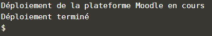 

- Cliquer sur l'onglet **"moodle"** :

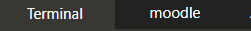

- Cliquer sur login :

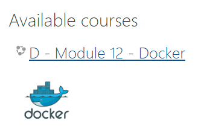

- Se connecter avec le compte **user** , mot de passe **"bitnami"** :

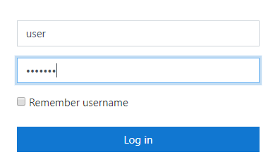

- Aller dans **Site administration** : 

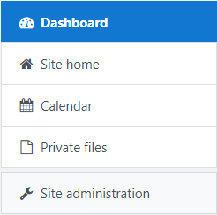

- **Plugins** 

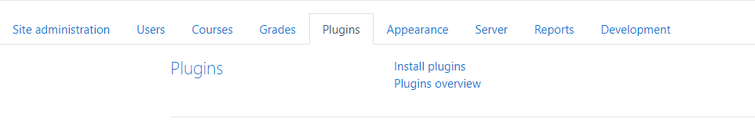

- **Repositories** > **Manage Repositories** :

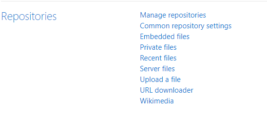

- Choisir **"Enabled and visible"** dans la section **"File system"** :

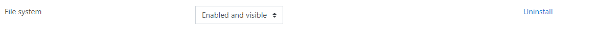

- Cocher toutes les cases et **"Save"** :

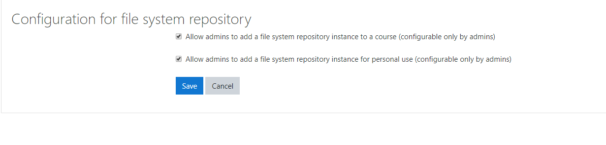

- Aller dans **"Settings"** dans la section **"File system"** :

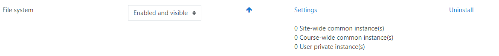

- Cliquer **"Create a repository instance"** :

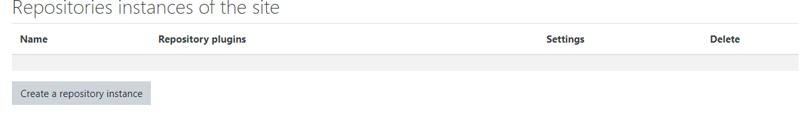

- Taper **docker** dans le champ **Name** et cliquer sur **"Save"** :

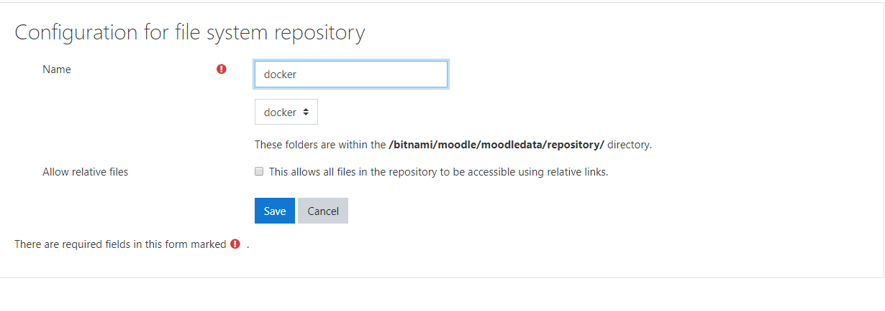

- Aller dans **"Site home"** :

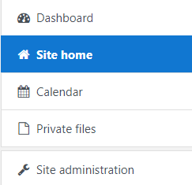

- A droite de l'écran, cliquer sur le triangle et choisir **"Restore"**

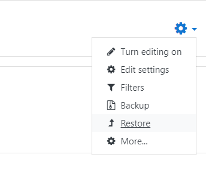

- Cliquer sur **"Choose a file"** :

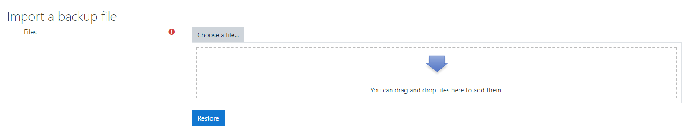

- Choisir **"docker"** et selectionner le fichier **"backup-moodle2-..."** :

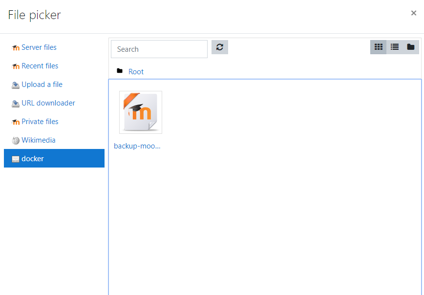

- Cliquer sur **"Select this file"** :

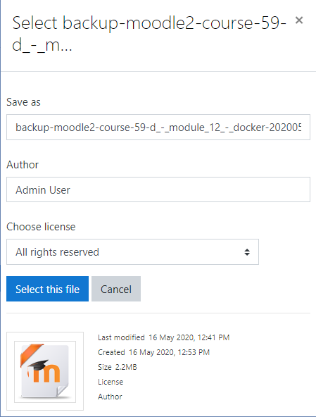

- Cliquer sur **"Restore"** :

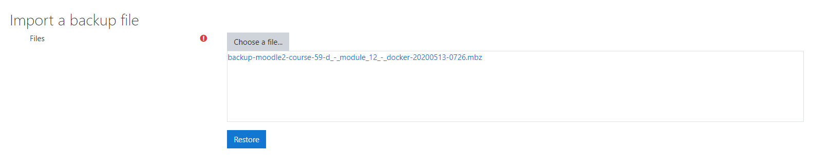

- En bas à droite de la page, cliquer sur **"Continue"** :

- Dans la section **"Restore a new course"**, cocher **"Miscellaneous"** et sur **"Continue"** :

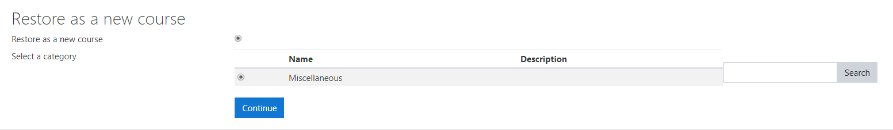

- En bas à droite de chaque page, cliquer sur **"Next"** ensuite **"Next"** puis **"Perform a restore"**

- Cliquer sur **"Continue"** :

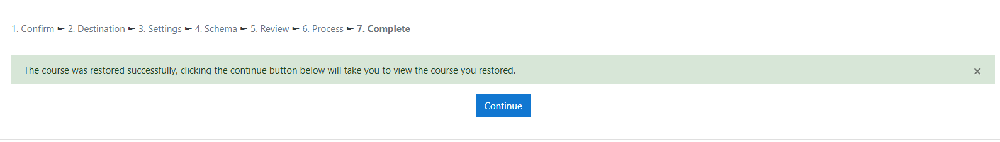

- La formation **docker** est disponible
