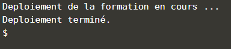

### Formation Docker

Se connecter à [Katacoda](https://www.katacoda.com/courses/ubuntu/playground)

```bash
$ git clone https://github.com/mclpfr/moodle.git
$ cd moodle/
$ bash setup.sh
```
- Attendre la fin du déploiement :

 
<div style="text-align:center"></div>

- Cliquer sur **"+"** et choisir **"View HTTP port 80 on host 1"** :


- Cliquer sur login :


- Se connecter avec le compte **user** , mot de passe **"bitnami"** :


- Aller dans **Site administration** : 


- **Plugins** 


- **Repositories** > **Manage Repositories**;


- Choisir **"Enabled and visible"** dans section **"File system"**


- Cocher toutes les cases et **"Save"**


- Aller dans **"Settings"**


- cliquer sur create repository instance
- Name : docker
- SaveRestore as a new course
- Site home -> retore -> choose file -> docker -> backup-moodle2-... -> Select this file -> restore -> continue -> Restore as a new course -> continu -> Next -> Next -> perform a retore -> continue
