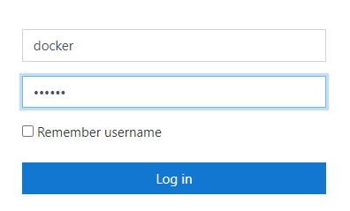

### Formation Docker

Se connecter à [Katacoda](https://www.katacoda.com/linagora/scenarios/docker-training)

- Cliquer sur le boutton **"Start scenarios"** :

 

- Attendre la fin du déploiement :

 

- Cliquer sur l'onglet **"moodle"** :

- Cliquer sur login :

- Se connecter avec le compte **user** , mot de passe **"bitnami"** :

- Aller dans **Site administration** : 

- **Plugins** 

- **Repositories** > **Manage Repositories** :

- Choisir **"Enabled and visible"** dans la section **"File system"** :

- Cocher toutes les cases et **"Save"** :

- Aller dans **"Settings"** dans la section **"File system"** :

- Cliquer **"Create a repository instance"** :

- Taper **docker** dans le champ **Name** et cliquer sur **"Save"** :

- Aller dans **"Site home"** :

- A droite de l'écran, cliquer sur le triangle et choisir **"Restore"**

- Cliquer sur **"Choose a file"** :

- Choisir **"docker"** et selectionner le fichier **"backup-moodle2-..."** :

- Cliquer sur **"Select this file"** :

- Cliquer sur **"Restore"** :

- En bas à droite de la page, cliquer sur **"Continue"** :

- Dans la section **"Restore a new course"**, cocher **"Miscellaneous"** et sur **"Continue"** :

- En bas à droite de chaque page, cliquer sur **"Next"** ensuite **"Next"** puis **"Perform a restore"**

- Cliquer sur **"Continue"** :

- La formation **docker** est disponible
