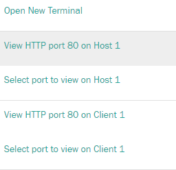

### Formation Docker

Se connecter à [Katacoda](https://www.katacoda.com/courses/ubuntu/playground)

```bash
$ git clone https://github.com/mclpfr/moodle.git
$ cd moodle/
$ bash setup.sh
```
- Attendre la fin du déploiement :

 

- Cliquer sur **"+"** et choisir **"View HTTP port 80 on host 1"** :



- Cliquer sur login :


- Se connecter avec le compte **user** , mot de passe **"bitnami"** :


- Aller dans **Site administration** : 


- **Plugins** 


- **Repositories** > **Manage Repositories**;


- Choisir **"Enabled and visible"** dans la section **"File system"**


- Cocher toutes les cases et **"Save"**


- Aller dans **"Settings"** dans la section **"File system"**


- Cliquer **"Create a repository instance"**


- Taper **Docker** dans le champ **Name** et **"Save"** 


- Aller dans **"Site home"**


- Aller dans **"Site home"**


- A droite de l'écran, cliquer sur le triangle et choisir **"restore"**


- cliquer sur create repository instance
- Name : docker
- SaveRestore as a new course
- Site home -> retore -> choose file -> docker -> backup-moodle2-... -> Select this file -> restore -> continue -> Restore as a new course -> continu -> Next -> Next -> perform a retore -> continue
