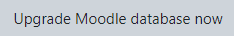
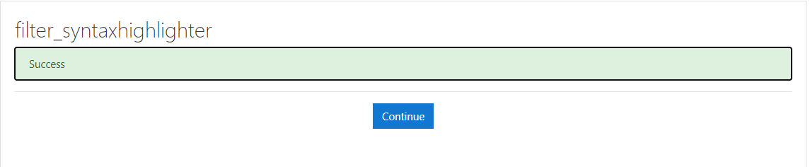
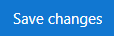
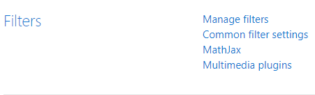
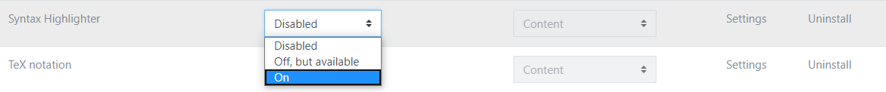

### Formation Docker

Se connecter à [Katacoda](https://www.katacoda.com/linagora/scenarios/docker-training)

- Cliquer sur le boutton **"Start scenarios"** :

  

- Attendre la fin du déploiement :

  

- Cliquer sur l'onglet **"moodle"** :

  

- Cliquer sur **"D - Module 12 - Docker"** :

  

- Se connecter avec le compte **docker** , mot de passe **"docker"** :

  

- Cliquer sur **Site administration** : 

  

- Cliquer sur **Update Moodle database now** :

  

- Cliquer sur **Continue** :

  

- Cliquer sur **Save changes** : 

  

- Cliquer sur **Site administration** :

  

- Aller dans l'onglet **Plugin** puis **Mange filters** :

  

- Activer **Syntax Highlighter** :

  

- Cliquer sur **Site home** :

  

- Cliquer sur **"D - Module 12 - Docker"** :

  

- Se module se compose de 5 chapitres et chaque chapitre se décompose en 3 parties (cours,exercices,quiz)

- Se connecter à [Play with Docker](https://labs.play-with-docker.com/) pour réaliser les exercices .
